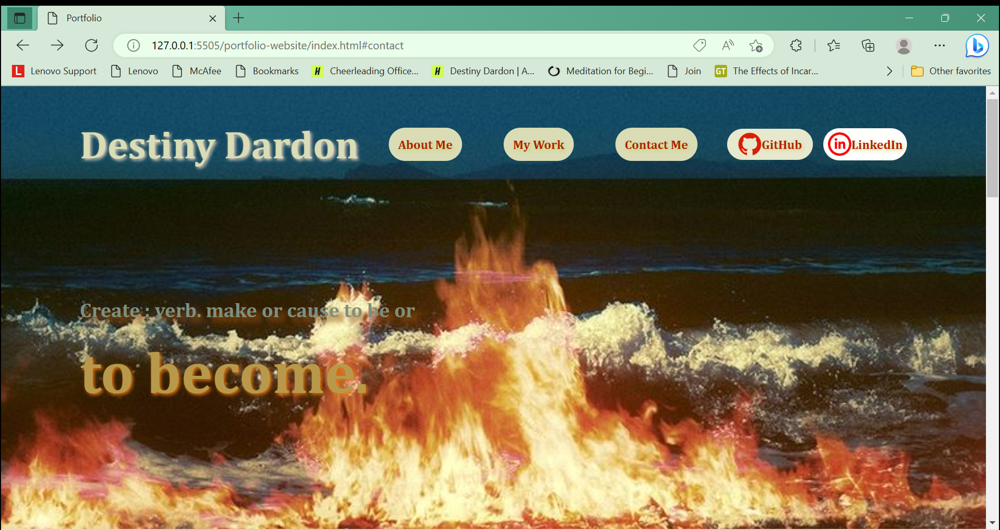

# Portfolio Website
## Description 

The motive of this project was to create a portfolio for potential employers, to view samples of our work. The application presents the developers name, a photo, and links to contact information and work samples. When the user clicks a navigation link, the UI will scroll to the corresponding section. This project solves the need to type a resume document for future employers. Throughout making this project I learned how to utilize basic HTML and CSS for my personal academic advantage.

##Links

Deployed Application URL : 

GitHub Repository Link : 

##Usage

This project contains 

##Website Screentshot

.png)
.png)
.png)
.png)

##Credits

